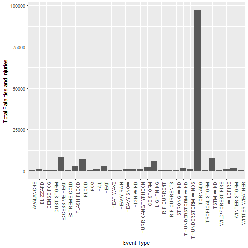
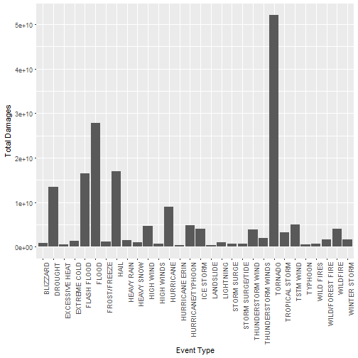

```r
---
title: 'Peer-graded Assignment: Course Project 2'
output: html_document
---
```

```
## Error: <text>:6:0: unexpected end of input
## 4: ---
## 5: 
##   ^
```

```r
setwd("C:/Users/S.Sagara/Documents/Data Science/coursera/R specialization/Reproducible Data/week4")
library(data.table)
library(dplyr)
library(ggplot2)
df <- fread("StormData.csv")
```

```
## 
Read 31.0% of 967216 rows
Read 48.6% of 967216 rows
Read 68.2% of 967216 rows
Read 83.7% of 967216 rows
Read 902297 rows and 37 (of 37) columns from 0.523 GB file in 00:00:06
```


Across the United States, which types of events (as indicated in the EVTYPE variable) are most harmful with respect to population health?

```r
#add fatalities and injuries
df$dth_inj <- df$FATALITIES + df$INJURIES

#summarize number of fatalities and injuries by event type
summary1 <- df %>% 
        group_by(EVTYPE) %>% 
        summarize(total_dth_inj = sum(dth_inj))

#sort death and injury count in descending order
summary1 <- summary1[order(-summary1$total_dth_inj),]
#show top30
summary2 <- summary1[1:30,]

#plot by ggplot2
g <- ggplot(summary2, aes(EVTYPE, total_dth_inj))
g + geom_bar(stat = "identity") + 
        theme(axis.text.x = element_text(angle = 90, hjust = 1)) +
        labs(x = "Event Type", y = "Total Fatalities and Injuries")
```


As shown by a graph, the most harmful event with respect to population health (fatalities and injuries) is by far the tornado.
Ohter harmful perils include the excessive heat, flood, lightning, and TSTM wind.

Across the United States, which types of events have the greatest economic consequences?

```r
#take care of unit of property damage
df$prop_u <- ifelse(df$PROPDMGEXP == "K", df$PROPDMG * 1000, ifelse(df$PROPDMGEXP == "M", df$PROPDMG * 1000000,df$PROPDMG))
#take care of unit of crop damage
df$crop_u <- ifelse(df$CROPDMGEXP == "K", df$CROPDMG * 1000, ifelse(df$CROPDMGEXP == "M", df$CROPDMG * 1000000,df$CROPDMG))
#add property and crop damage
df$tot_dmg <- df$prop_u + df$crop_u

#summarize prop and crop damage by event type
summaryd <- df %>% 
        group_by(EVTYPE) %>% 
        summarize(total_damage = sum(tot_dmg))
#sort by total damage in descending order
summaryd <- summaryd[order(-summaryd$total_damage),]
#show top30
summaryd2 <- summaryd[1:30,]
#plot by ggplot2
g <- ggplot(summaryd2, aes(EVTYPE, total_damage))
g + geom_bar(stat = "identity") + 
        theme(axis.text.x = element_text(angle = 90, hjust = 1)) +
        labs(x = "Event Type", y = "Total Damages")
```


As shown by a graph, the event with the greatest economic consequences is again the tornado.
Ohter perils include the drought, flashflood, flood, hail, high wind, hurricane, TSTM wind, wild fire, and etc..
```
```

